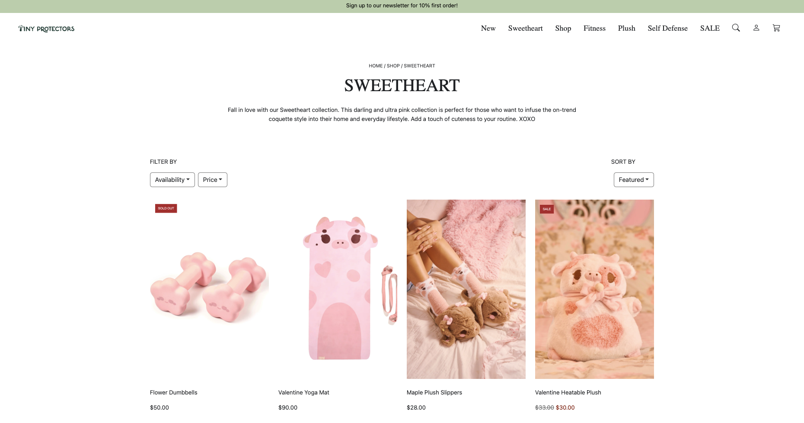

## Thoughts on UI Development & Framework
Coming from someone who loves to code on a daily basis and design graphically as a side hobby, UI development became the best of both worlds for me. It allowed me to blend my coding skills with my love of creating visually appealing designs. Through my learning journey with UI development during my ICS 314 class, I had the opportunity to learn about, or be introduced to, UI frameworks, specifically Bootstrap 5. 

During an in-depth class discussion about this UI framework, it reminded me so much of Code.org, an educational platform designed for younger students and educators to learn programming. On this platform, a variety of code-blocks or built-in functions are provided, which I generally utilized in all of the projects I developed for my computer science class during my junior year of high school. If you haven't already, feel free to check out the projects I developed using Code.org: [Retro Space Invader Replica](https://angelaalmeron.github.io/projects/retro-space-invader.html) and [LHS Alma Mater](https://angelaalmeron.github.io/projects/alma-mater-app.html). Similarly to Bootstrap 5, it contains a vast array of pre-built CSS custom properties that not only make theming and customization easier, but also speed up development time. Additional features that come to mind include being useful for ensuring consistent look across projects, an advantage for those who may not be experts in CSS as it handles a lot of the complex styling and layout, and so forth.

### The Downside of Bootstrap 5
Though Bootstrap 5 offers quick development and consistent outcomes, the main downside of this is that it restricts the range of design elements, thereby limiting the creative flexibility. In other words, using Bootstrap 5 may not always accommodate all design requirements, particularly for projects that demands highly distinctive or innovative features. Consequently, this is where one may find raw HTML and CSS more useful because they allows complete customization and control over every aspect of the website's design and functionality. By coding from scratch, developers can craft unique layouts and components that fully align with their specific creative visions or complex aspects that a pre-designed framework might not be able to support effectively. 

### Learning Curve 
For the reason that Bootstrap 5 reminded me so much of using Code.org is that it can be frustrating at some point and difficult to grasp for the first time, or another way to look at it is like learning a new programming language. It can be complex and require a significant investment of time and effort to master. However, similarly to my experience with Code.org or learning a new programming language, the initial learning journey won't always be easy, but with continuous practice and once I get the hang of it, I will definitely start loving and finding this useful as this UI framework offer many helpful opportunities in developing projects efficiently.

### Projects made with Bootstrap 5
Here are some of the websites I've attempted and practiced: 

**Recreation of Island Snow**

**Original v.s. Recreation of Tiny Protector's Sweetheart page**

## AI Usage
In writing this essay, I've utilized AI to refine the flow and enhance the way concepts are expressed.