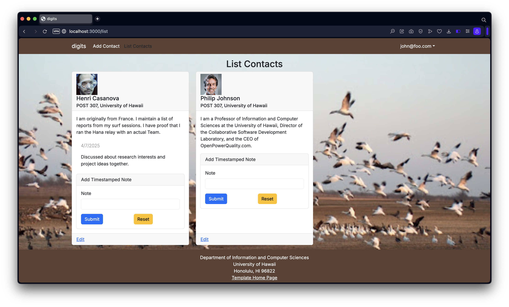
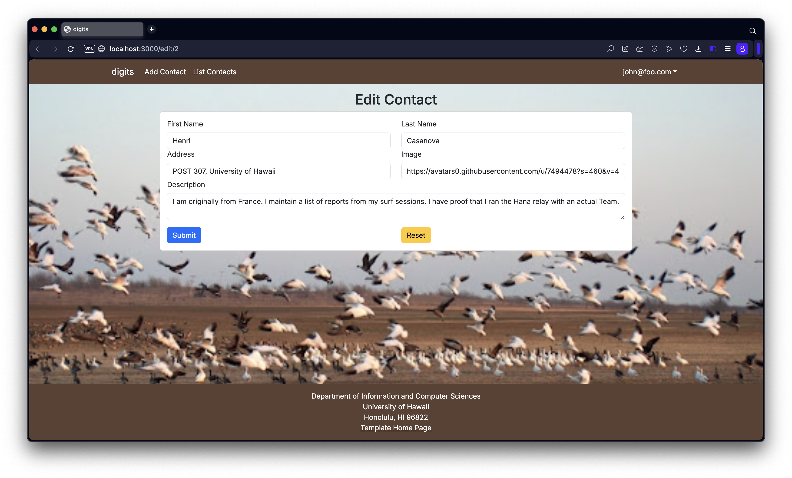

## The Cookbook of Coding
When I was first questioned to define *"design patterns in coding,"* I immediately thought it had something to do with how the code looks, like visual styles or layouts. But guess what? It is not about the appearance at all. After learning more about this concept in class, I then realized that design patterns are about how the code is structured, not how it looks. I'd say it was quite interesting to discover how different the meaning was from what the words first suggested.

### Zooming In
To dig a little deeper, a design pattern is basically a reusable solution to a problem that commonly pops up in software development. Think of it like this: imagine walking into two different kitchens—in one, chefs are cooking without recipes, guessing their way through every dish—sometimes it's delicious, sometimes it's barely edible; in the other, chefs follow tested, perfected recipes passed down through generations. That is what design patterns are to software developers—they're the *"recipes"* for solving common coding problems. Another way to put it is: instead of starting from scratch each time, we can rely on these proven and trusted blueprints to guide us toward building clean, efficient, and reliable code, like following a cookbook!

***Why is it important to learn design patterns?*** Multiple reasons:
- More efficiency, because developers can now avoid finding solutions to same recurring problems or not having to figure everything out from scratch, saving time and effort.
- These are solutions that have been tried and tested.
- Enhances teamwork because everyone can recognize the familiar patterns.
- More flexibility, because it's like a flexible framework or an approach that developers can adapt to their specific project's needs—just like tweaking a recipe based on the ingredients we have available.

In short, design patterns are what developers use to solve problems smarter, not harder.

## Cooking with Patterns
After skimming through the different types of software design patterns, first off, I did not expect that there's quite a lot of them, but most fall into three categories:
- *Creational Patterns* (create objects in a flexible and reusable way)
- *Structural Patterns* (organize classes and objects into larger structures)
- *Behavioral Patterns* (manage communication and responsibility between objects). 

If you are ever interested in learning more, I found a helpful site—[Software Design Patterns Tutorial](https://www.geeksforgeeks.org/software-design-patterns/#types-of-software-design-patterns)—that goes further in-depth into each type. 

In my own projects, I've leaned on several design patterns without realizing it nor knowing the name for it. As I skimmed through each types of design patterns, I think there is one common example that I found myself using—Observer Pattern—when I worked with Bootstrap, React, Next.js, and Postgres. 

For example, in one of my projects where users could edit a contact’s information (e.g., headshot, their name, work address, or description), once they clicked "Submit," the changes would instantly show up in the list of contacts without needing to refresh the page. Whenever a user updates something, the rest of the app "listens" and responds automatically to those changes. That’s basically the heart of the Observer Pattern: when one thing changes, anything connected to it gets notified and updated too. It made the web application feel smoother and more alive, instead of forcing the user to reload or manually check if their changes went through.

## Final Thoughts
I was told that defining design patterns is a common interview question. To me, knowing and applying design patterns is not about trying to sound smart in interviews—it's about becoming a better software engineer. When using these patterns, it's like standing on the shoulders of decades of brilliant developers who already tackled similar problems we are facing today. So next time someone asks, "What are design patterns?" or "Have you used any?" I'd say, "They're like the recipes that turn kitchen chaos into five-star meals—and yes, I've definitely cooked with a few." (Maybe not exactly that in an interview, but you get the idea.)

### Note on AI Use
*This essay was written with the help from AI. I collaborated with AI to help brainstorm and organize the structure of this essay, but all the final content, voice, and personalization were reviewed and tailored by me.*