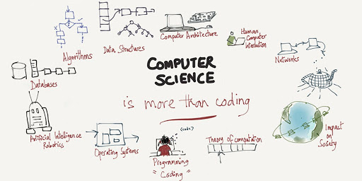

## Silent Codes, Loud Impact
*Every day, millions of lines of code are written to solve complex problems by countless software engineers who often remain in the shadows.*

Does it ever matter to me? To be visible behind the works? No, not in the slightest. Ever since I've been introduced into the world of computer science and software engineering, I've made and embraced one dream for myself--not just to merely develop, program, and design, but to create something that can truly impact many people positively. That alone is enough for me. Take *ChatGPT* as an example, I frequently hear from fellow classmates, friends, professors at my university, and even tech professionals I've met at career fairs enjoy utilizing this AI tool for several reasons. Though I am fully aware of the criticisms of AI as a potential to "cheat" or "take over" jobs, and yes, it has its flaws-what doesn't?-I continue to see it as an impact to many people IF used ethically. Most people, including myself, love to use it as a form of help to understand, brainstorm, enhance writing, receive desired information rather quickly, and simplify tasks that once took hours into mere minutes. This is all I care as an upcoming software engineer, where I value the impact rather than recognition because knowing that something I've coded can make such a difference is all the recognition I need.

## Personal Vulnerabilities: Comparison by Nature
Despite frequently praising my little passion in the computer science field, it's still widely acknowledged that it's a competitive and challenging field to embark on. Coming from an individual who does not have a lot of experience and relatively new to programming, I can't help compare myself with those who are more experienced when thinking about skills, level, creativity, critical thinking, and so forth. Because of this, I rushed myself, in hopes that I quickly find myself a place among more experienced peers. 

However, as I've progressed in my studies as a CS student and connect with upperclassmen and tech professionals, I've found a comforting sense of relief and belonging. It was incredibly encouraging to hear their stories and realize that most have been in my shoes before, helping me feel more at ease with my own journey. Not only that, it became a continuous reminder that setbacks are not experienced only by me but are a universal part of growth in this demanding field.

Nevertheless, this does not mean that my personal vulnerabilities completely vanished. For instance, the upset and stingy feeling of giving it my best shot yet failing short, or the habit of comparing myself to others, still linger in me. How do I lift myself up during these times? I simply remind or see myself of where I wanted to go, why I chose this, and how much of a waste if I gave up after coming this far. I strive to learn from each failures, just like how those tech professionals turned their setbacks into stepping stones. Therefore, rather than viewing each setback as a defeat, I like to view it as a valuable opportunity to learn and grow. 

## Wish to Gain
So, what is my goal moving forward? At this moment, progressing through my academic journey as a CS student is a priority, where I can continue to learn from tech professionals' inputs, grow from setbacks, and continue to gain more skills and experiences. Not only that, but to continuously remind myself of where I stand in the computer science field as a little push to keep going.

## AI Usage
In writing this essay, I've utilized AI to refine the flow and enhance the way concepts are expressed.
