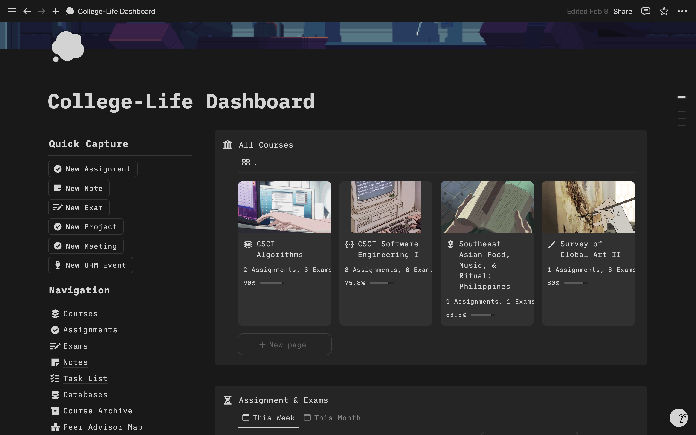
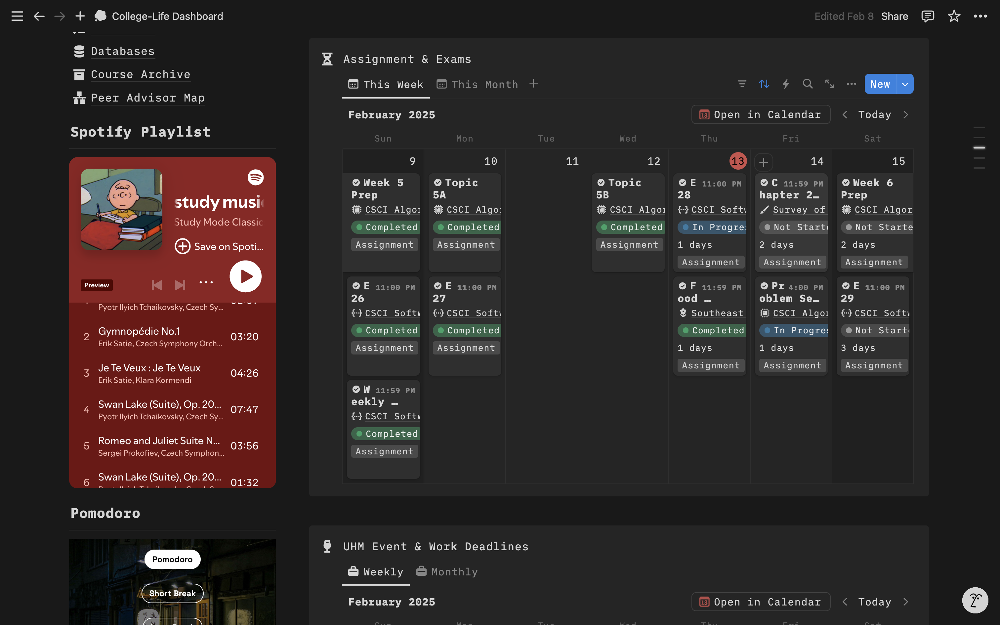
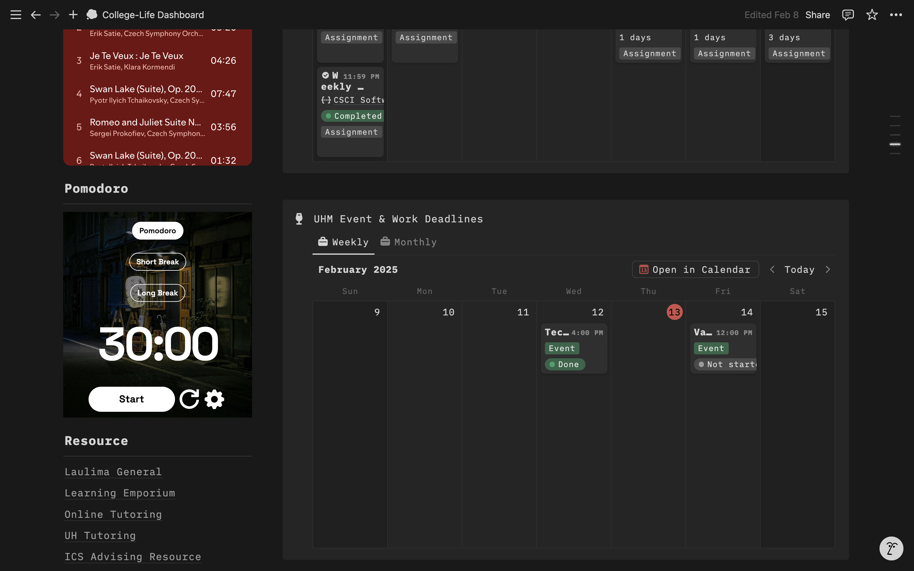
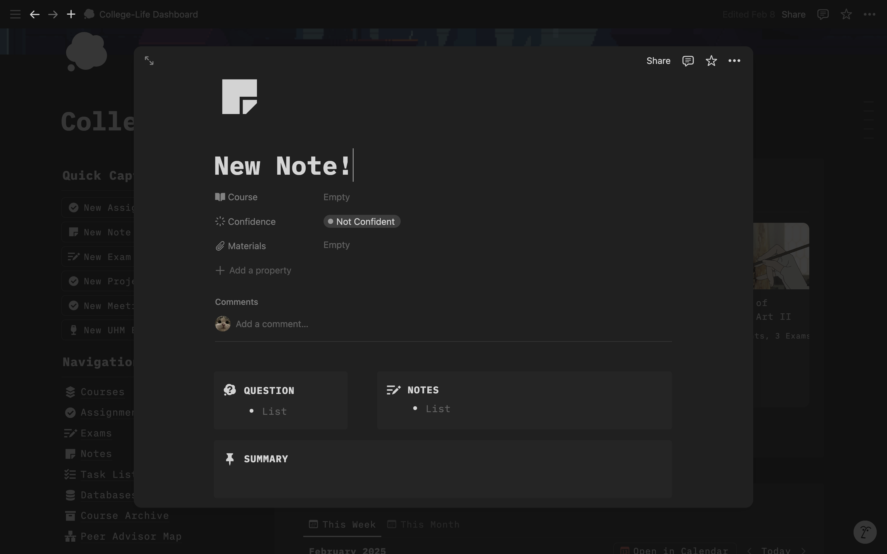

## Perfectionism Character
If you were to get to know me more personally, you'd gradually see how much of a perfectionist I can be. Most people, including myself (occasionally), may consider this trait as a "bad thing." I set very high expectations for myself, and I often stress about it, struggle to let go of even the smallest mistakes (and I mean, it is quite difficult), and last but not least, I often have trouble finishing tasks quickly because I tend to spend a lot of time to pay great GREAT attention to every little details. In the end, I simply can't help it, especially because noticing small imperfections bothers me for hours, or in the worst case, days. It has simply become an essential part of my daily functioning, or in simple terms, a habit.

### Perfectionism isn't all bad
Do I often see it as a "bad thing"? Not really, because there are other aspects of this trait that I consider advantageous. The high expectations I set for myself drive me to work very hard to meet them, or generally, I work to make things "just right" (a reference to *"Goldilocks and the Three Bears"*). Paying great attention to every little detail doesn't sound too bad because it results in clean and neat projects. One easy example is creating flyers or PowerPoint presentation for my department, where almost everything is aligned, matching the writing format, and designed to look aesthetically pleasing with enhanced readability. Another essential benefit is aiming to be well-organized and systematic in everything I do. I absolutely love to plan ahead because it reassures me that the tasks are reasonably manageable. One easy example is a filled-up calendar, ensuring each and every deadline is met. 

Another great example that I am particularly proud of is a system I've created on a platform called *Notion*, described as *"a productivity and note-taking web application"* ([Wikipedia](https://en.wikipedia.org/wiki/Notion_(productivity_software))). I like to call it my "College-Life Dashboard," which centralizes all of the essentials I need for college. It includes details of all my current semester classes like syllabus information, scores, deadlines, and notes. There are two calendars: one for assignment and exam deadlines, and another for work projects and college events I may be interested in attending. My biggest favorite feature is the *quick capture* on the left corner of the page, which has buttons for adding new deadlines or events to the calendar, or for creating structured Cornell-style notes for a class lecture. Additional features on the corner include *navigation* (navigates you to all of the pages like deadlines, notes, etc.), music playlist to listen to while studying, a Pomodoro-*"a time management method...it uses a kitchen timer to break work into intervals, typically 25 minutes in length, separated by short breaks"* ([Wikipedia](https://en.wikipedia.org/wiki/Pomodoro_Technique))-timer, and last but not least, helpful resouurces that link directly to their websites.






## Perfectionism + Coder
Just as my perfectionism drives me to ensure every part of my daily life is organized and meticulously planned, it plays a similar role in my coding endeavors. When I am programming, every line of code, indentation, and comment must be in perfect order. If I notice any small imperfections when reviewing my work later, as mentioned before, it will bother me for hours, or in the worst case, days. Again, I completely acknowledge that this may seem slow or meticulous to others, but it helps me avoid errors and enhances readability for others who read my code. Plus, it makes it look nicer.

### Thoughts on Coding Standards
I've had two contrasting experiences with coding standards: one class almost drove me to the brink, while the other made my life so much easier. ICS 212-a course that centered on the C/C++ programming language-first introduced me to coding standards. In other words, the coding assignments I turn in must be formatted in a specified way that adhere to the class' coding standards, otherwise, couple of points will be deducted. At the time, it was slightly challenging to adhere to these standards as the code was being developed in a Linux terminal, which does not offer any shortcuts or formatting warnings, requiring us to manually ensure (or rely on hope) that each line and block of code adheres to these standards. Fortunately, most of the coding assignments for this class were manageable in size. 

Here is how the formatting looks like or my ICS 212 class' coding standard: 
```
/**
 * This program is designed...
 *
 * @author     Almeron, Angela Joy
 * @assignment ICS 212 Assignment [number]
 * @date       [today's date]
 */

#include 
#define

class [className] {
  /**
   * [documentation]
   *
   * @parameter
   * @return
   */
  constructor() {
    ...
  }

  // [comment]
  method() {
    ...
  }
}

int main(){
  ...
}

```

ICS 314-a course that focuses on software engineering-on the other hand, introduced us to a specific tool called ESLint on VSCode that helps or assists me in writing quality code that adheres the class' coding standards, and it made my life so much easier as a *perfectionist coder*. I am compelled not only to address every error-such as code or style issues-but also to understand why each issue was flagged, which significantly helps me not only write better code and improve code quality but also enhance my coding skills. I will admit, though, besides the beneficial aspects of ESLint, my initial experience with ESLint during the first week of using it was a bit painful and annoying because I spent hours trying to understand and resolve what might be the issue, a situation that may reoccur in the future. 


One might ask, what are my general thoughts on coding standards? Focusing more on coding standards rather than the different techniques to help adhere to these standards, I'd say they are actually helpful guides. Making code look nice is just one aspect of it, but what is more important is understanding why consistency in coding matters and how these standards makes the code more readable and easier to manage, especially when working in teams. The point I am trying to make is that it is not just about the code working correctly; it is also about writing code that can be easily understood and modified by others or by me in the future. This will become an essential aspect moving forward because in this field, we all love to work in teams, so we need code that makes collaboration easier!

## AI Usage
In writing this essay, I've utilized AI to refine the flow and enhance the way concepts are expressed.
