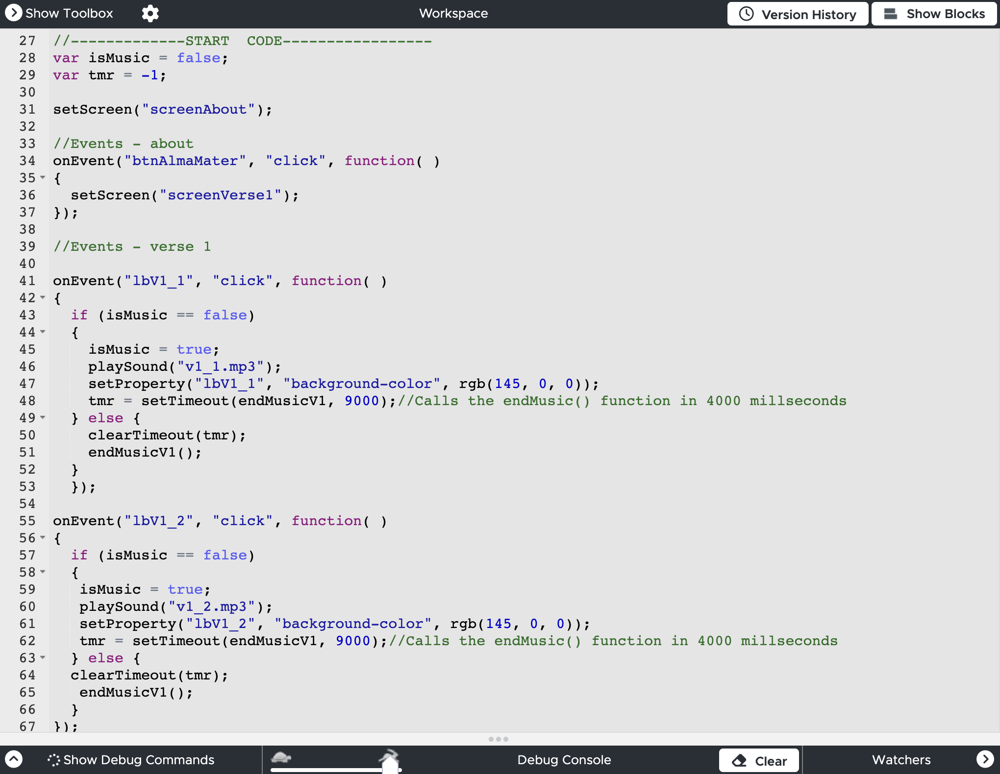

### Overview
**LHS Alma Mater** is an interactive application I developed to help users, particularly the students of Lahainaluna High School, learn the school's alma mater song. The main user-friendly feature of this app is that users can click on any line of the song, and it will play the Class of 2021 students singing that line specifically. One additional feature I would like to highlight is that since the song is in ʻŌlelo Hawaiʻi, I added an English translation right below of that specific line of the song to fully carry out the purpose of this app, meaning not just to learn how to sing the song, but also learn what the song lyrics mean.

This app is written in JavaScript, and similarly to ["Retro Space Invader Replica"](https://angelaalmeron.github.io/projects/retro-space-invader.html), this is also developed under **Code.org**. Therefore, it already contains built-in functions and method for me to utilize.

### Style Switch
For this project, it is a continuation of applying what I've learned in terms of the basic programming syntax and the programming language, JavaScript. However, the only difference from this project is that I shifted to writing or typing the code myself without the help of code blocks or utilizing them. This shift created a slightly new challenge for me because at the time, I was feeling a little frustrated about keeping track of the blocks of code, the brackets, and the semicolons. Nevertheless, I still find it significantly helpful because not only did it allow me to apply my understanding more deeply, but it was also an excellent practice for me.

### Try it out yourself!
If you are ever interested, you can try out the app yourself with an option to view and edit the code! Enjoy the app! [LHS Alma Mater App](https://studio.code.org/projects/applab/vA4huXufMyU3RNVgLMtgHObxCiyUk9p19UHcsBO6hLQ)
