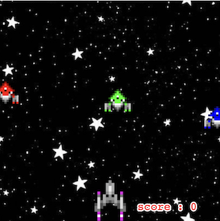
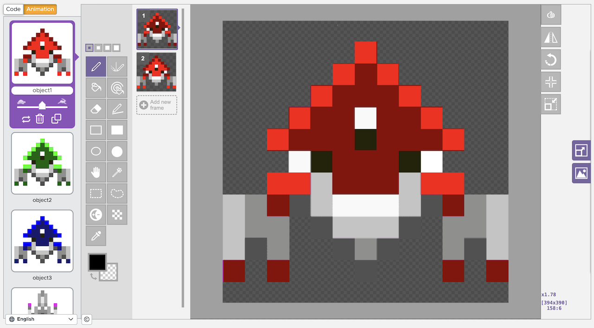

  

**Retro Space Invader Replica** is exactly what the title implies. I developed a gaming project that replicates the “Retro Space Invader.” **A brief overview:** the game’s main objective is for players to earn as many points as they can by eliminating incoming opponents. The player controls the spaceship located at the bottom of the screen, which can be rotated up to 180 degrees and shoot projectiles. Opponents appear at the top and descend at a random speed toward the player, and each hit on an opponent adds points to the player’s score, while missed shots and enemy contacts with the player will reduce the points. 

This project is written in Javascript and since this is developed under **Code.org**, an educational platform that provides coding lessons and activities that are typically designed for younger students and educators, it contains code blocks or built-in functions and methods like playSound(URL, loop) or .isTouching(target) as instances. An additional feature I would like to highlight from this platform is sprites and its functions, in which I have primarily utilized for the project's game components and operations. For those who may not be familiar what "sprite" is, it is *"a two-dimensional (2D) graphical object used in computer graphics, particularly in video games"* (Andrew Löw, [What is a sprite?](https://www.codeandweb.com/knowledgebase/what-is-a-sprite#:~:text=A%20sprite%20is%20a%20two,combined%20to%20create%20an%20animation.)). 

  
  

  

**Fun Fact:** This is the very first programming project I have ever developed myself! Though it was a mere assignment in my junior year of high school, it was one of the first projects that I felt proud of, and that drove me to gain more and more interest in choosing computer science as a major or career. Other than that, it was also a fun little challenge, debugging and figuring out how to create solutions to problems or fix the small issues.

At the time of the project, it was more of a complete hands-on experience and/or application to what I've learned about basic programming syntax and the programming language, Javascript. This includes declaring, initializing variables, creating functions, conditional if-else statements, and debugging. In this project, I've also learned about how important keeping track of the block of codes, or the brackets and semi-colon. Therefore, since this was the first hands-on project at the time, we students developed the project with the help of the code blocks.

If you are ever interested, you can try out the video game yourself! Enjoy! [Retro Space Invader](https://studio.code.org/projects/gamelab/sAhIqEup5uvzhhMh6Y3HpP83U-ac6m9WPs0KxE6B8w8) 
