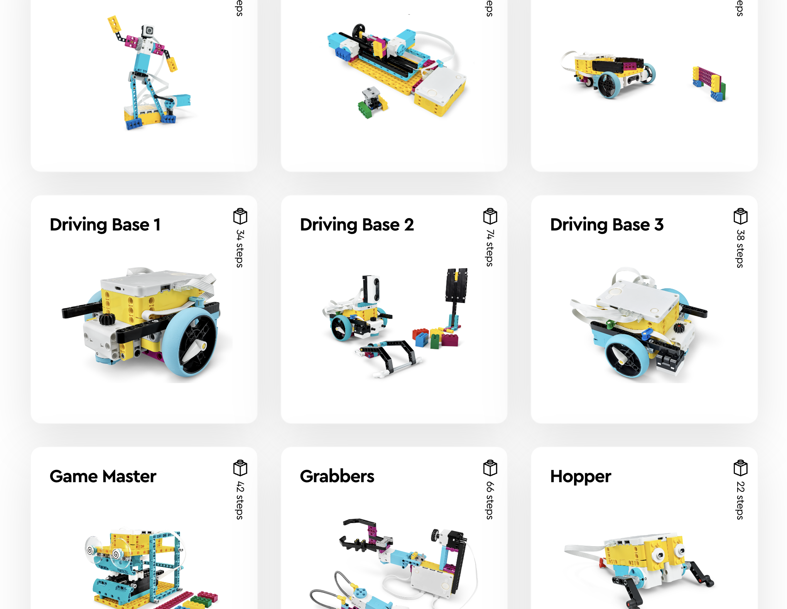
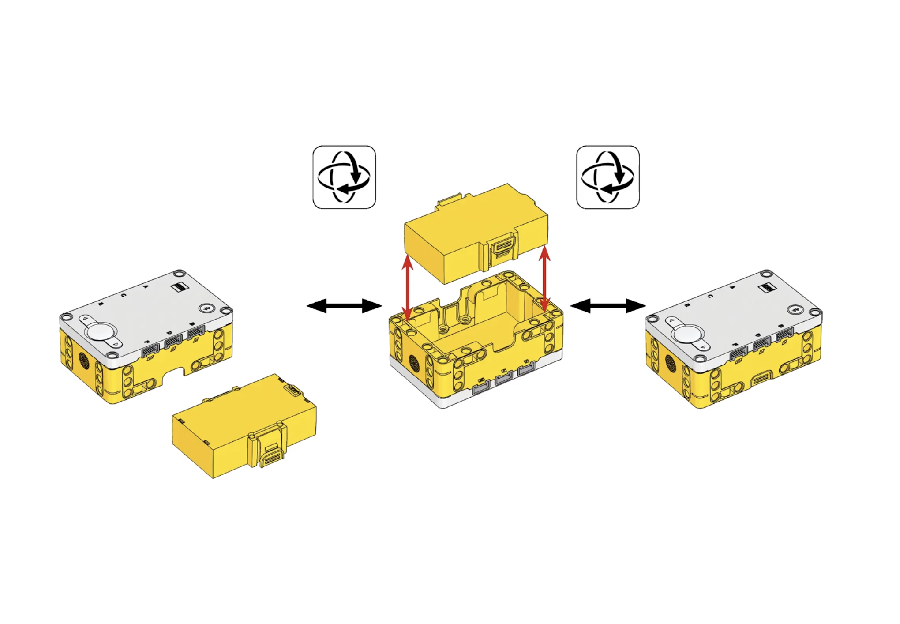
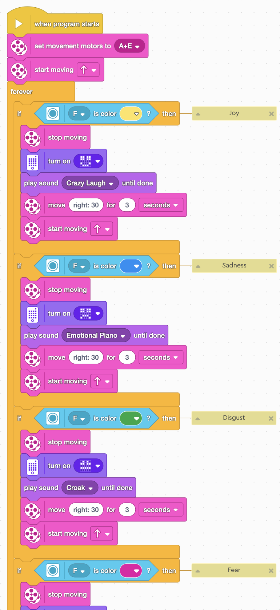
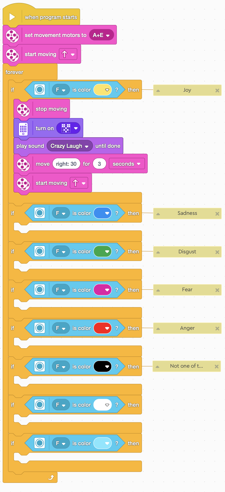

### Overview
**Dyector Robot** utilizes the [LEGO Education SPIKE Prime](https://spike.legoeducation.com/prime/lobby/), an innovative robotics kit, to educate middle school students visiting UH Manoā on the essential STEM concepts through a hands-on learning experience, particularly about computer software and hardware. My team and I planned this project out in a way that students can enjoy engaging with and also educate them on a few of the essential aspects of computer science. This includes the definition of software and hardware, the agile methodology, conditional if-else statements, and, most importantly, working together as a team. We don’t mean working with their own teams but with the other teams as well. To be specific, in this instance, the software and hardware teams will need to work together by continuously communicating with each other in order to enhance the product’s quality.

**What does the robot do?** Inspired by the movie "Inside Out," this robot performs a variety of actions based on color detection. Upon starting the program, it drives forward until it detects a specific color. Recognizing one of the themed colors from "Inside Out" or any other distinct colors will trigger responses: the robot may display an emotive face, message, etc., on the remote's screen or play a specific sound. After executing these actions, it will adjust its direction by turning at a designated angle to find the next color.

### Code Crafting
In this project, I was more responsible for programming, testing, and enhancing the code for how the robot should operate. This is to ensure that there were no bugs, connection, or operation issues with the robot so that it would be a breeze when the students try it out for themselves. Furthermore, I was also responsible for structuring the code so that students could engage with it at their level. In further details for the structure that I would like to highlight, I left the robot’s movements and one conditional statement filled with actions when the robot detected a specific color, while the rest of the conditional statements had empty actions when detecting other colors. This way, the students can be creative and enjoy engaging with programming.

### Beginning Journey as CS Advisor
Overall, this project was more wholesome for me, interacting with kids and helping them learn computer science. However, it was also a great learning experience for me in terms of educating and guiding students properly without directly giving them the solution but instead helping them be creative with their solutions in their own way. Additionally, since this was the first project I have been a part of in the ICS department, an addition to this project for me is setting a small example of how to become a great major advisor and guide students through their academic journey and success without just telling them what to do but offer options that they can choose from on their own.

**Here's a fun fact about the name!** Dye + Detector = Dyector. The robot’s sole purpose is to perform a specific action when detecting a color. 
