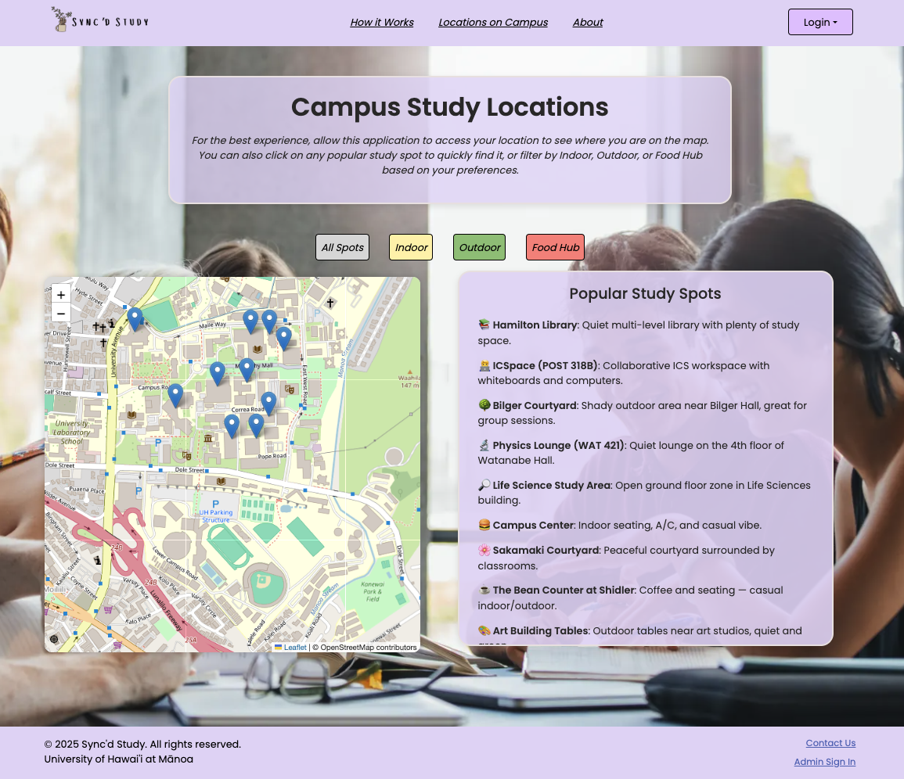
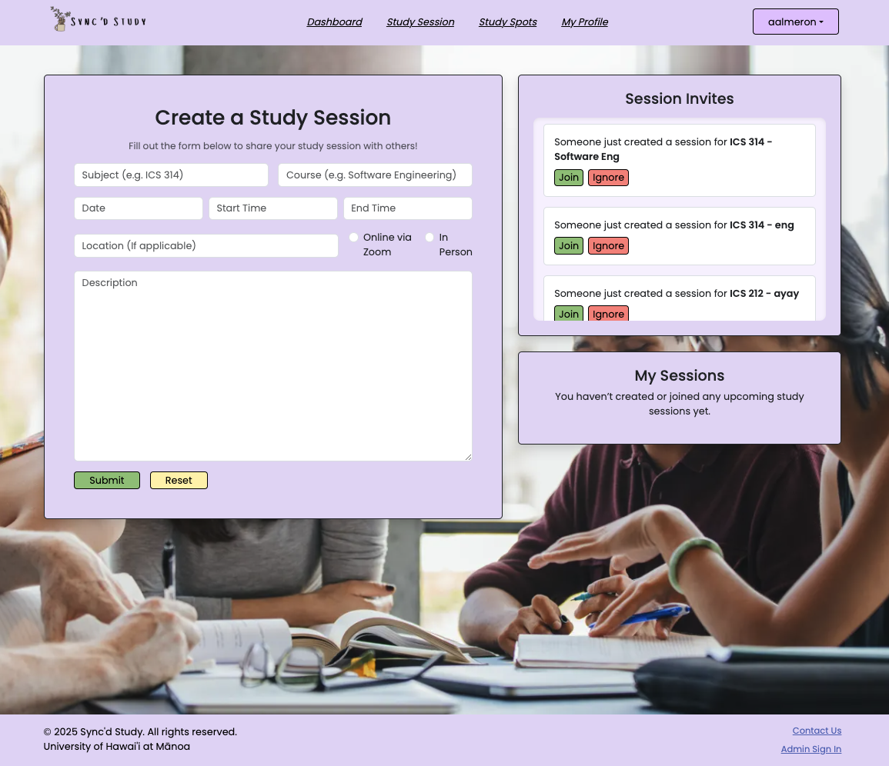

### Overview
*[Sync'd Study](https://syncdstudy.github.io)* is a web application that my team and I built for our ICS 314: Software Engineering final project. It is designed for UH Mānoa students, providing them space to collaborate, connect with their peers, create or join study sessions, and stay motivated throughout the semester. Throughout the development process, we've utilized the GitHub Project Board to evenly split the tasks/issues, track our progress using the IDPM (Issue Driven Project Management) tracker, and maintain and structure our workflow.   

### Contributions
In terms of contribution to this project, I've primarily focused on the front-end development, where I am responsible in building the layout for our landing page, creating a customized navigation bar that adapts based on the user's role (e.g., showing different options for users, admins, and public visitors), and the footer. I also assisted my team with the back-end setup, helping to integrate Supabase for database management and Prisma for data modeling. Additionally, I handled the styling, such as designing our logo and selecting a cohesive color scheme for the website’s overall theme (e.g., navigation bar, buttons, link hovers, and other interactive elements), ensuring the design reflects our project’s identity. 

Beyond coding, I am responsible for maintaining our project documentation, which explains the site's purpose, guides users on how to interact with the platform, and provides instructions for developers interested in trying it themselves. The goal is to clarify the site’s features and functionality, ensuring others can easily understand and navigate the platform. Lastly, I am responsible for managing our GitHub project board, creating and organizing issues for my team, and helping keep our workflow clear and on track.

This web application is built using: 
- *Frontend*: Next.js & CSS
- *Backend*: Prisma, Supabase, & Vercel

Sync'd Study links:
- [Live Application](https://syncdstudy.vercel.app)
- [Project Home Page](https://syncdstudy.github.io)
- [GitHub Organization](https://github.com/syncdstudy)

---
### Sync'd Study Preview

---
### Learning Experience
This final project is a huge valuable learning experience for me, giving me the opportunity to collaborate in an amazing team to develop a full-stack web application from the ground-up. Throughout the development process, I've learned the importance of troubleshooting complex issues, especially when working with database management (e.g., Prisma & Supabase/PostgreSQL). Furthermore, it strengthened my skills in Next.js, CSS, Vercel, Prisma, and Supabase/PostgreSQL. Last but not least, it reinforced the value of **clear communication** and **teamwork**,  both of which are essential for successfully navigating team-based projects and preparing for real-world challenges as software engineers.